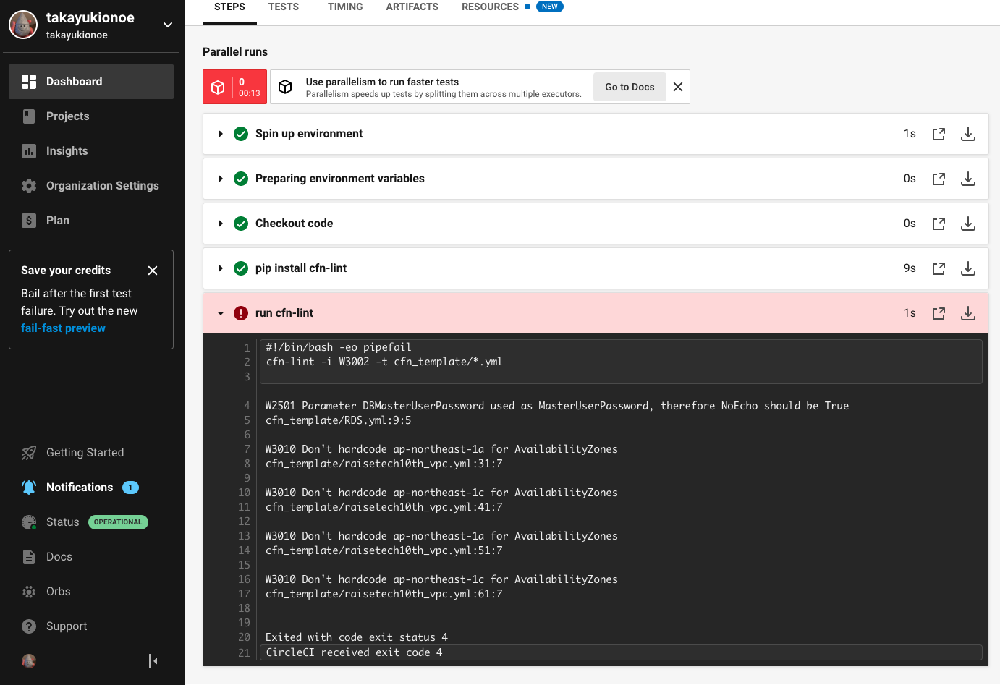

# 第12回課題

## ゴール
* CircleCI のサンプルコンフィグを用いて、CloudFormationのテンプレートが正しく動作す
るかどうかリポジトリに組み込み確認する。

## 手順
* [公式ドキュメント](https://circleci.com/docs/ja/getting-started/)通りに操作して、初期設定。

* .circleci/config.ymlとして課題のサンプルを使用、cfn_template配下に格納しているymlファイルを指定
  ```config.yml
    version: 2.1
    orbs:
      python: circleci/python@2.0.3
    jobs:
      cfn-lint:
        executor: python/default
        steps:
          - checkout
          - run: pip install cfn-lint
          - run:
              name: run cfn-lint
              command: |
                cfn-lint -i W3002 -t cfn_template/*.yml
    workflows:
      raisetech:
        jobs:
          - cfn-lint
    ```
*  第10回課題で作成した、テンプレートに対して、構文テストが実行される（下記は１回目実行結果）
     * 
 
* エラー内容
    ```
        W2501 Parameter DBMasterUserPassword used as MasterUserPassword, therefore NoEcho should be True
        cfn_template/RDS.yml:9:5
        
        W3010 Don't hardcode ap-northeast-1a for AvailabilityZones
        cfn_template/raisetech10th_vpc.yml:31:7
        
        W3010 Don't hardcode ap-northeast-1c for AvailabilityZones
        cfn_template/raisetech10th_vpc.yml:41:7
        
        W3010 Don't hardcode ap-northeast-1a for AvailabilityZones
        cfn_template/raisetech10th_vpc.yml:51:7
        
        W3010 Don't hardcode ap-northeast-1c for AvailabilityZones
        cfn_template/raisetech10th_vpc.yml:61:7
        
        
        Exited with code exit status 4
    ```

* エラー内容に対する修正方法
     1.  W2501 Parameter DBMasterUserPassword used as MasterUserPassword, therefore NoEcho should be Truecfn_template/RDS.yml:9:5
     * このエラーは、DBMasterUserPassword パラメータが MasterUserPassword として使われているため、
        NoEcho を True に設定する必要があるという警告です。NoEcho を True に設定することで、
        パスワード情報が CloudFormation の出力やログに表示されないようになり、セキュリティが向上します。

    2. W3010 Don't hardcode ap-northeast-1a for AvailabilityZones
    cfn_template/raisetech10th_vpc.yml:31:7
    
    3. W3010 Don't hardcode ap-northeast-1c for AvailabilityZones
    cfn_template/raisetech10th_vpc.yml:41:7
    
    4. W3010 Don't hardcode ap-northeast-1a for AvailabilityZones
    cfn_template/raisetech10th_vpc.yml:51:7
    
    5. W3010 Don't hardcode ap-northeast-1c for AvailabilityZones
    cfn_template/raisetech10th_vpc.yml:61:7
    
        * これらのエラーは、AvailabilityZones がハードコードされているという警告です。
        ap-northeast-1a や ap-northeast-1c といった特定の可用性ゾーンを直接指定するのではなく、
        パラメータやマッピングを使用して柔軟に可用性ゾーンを指定することが推奨されます。
        これにより、テンプレートが他のリージョンや可用性ゾーンでも使いやすくなり、耐障害性が向上します。

         ```raisetech10th_vpc.yml
         Parameters:
          AvailabilityZoneA:
            Description: Availability Zone A
            Type: String
          AvailabilityZoneB:
            Description: Availability Zone B
            Type: String
            
        Resources:
          # 省略 (変更なし)
          
          PublicSubnet01a:
            Type: AWS::EC2::Subnet
            Properties:
              AvailabilityZone: !Ref AvailabilityZoneA
              VpcId: !Ref myVPC02
              CidrBlock: 10.0.0.0/20
              Tags:
                - Key: Name
                  Value: PublicSubnet01a
                  
          PublicSubnet01c:
            Type: AWS::EC2::Subnet
            Properties:
              AvailabilityZone: !Ref AvailabilityZoneB
              VpcId: !Ref myVPC02
              CidrBlock: 10.0.16.0/20
              Tags:
                - Key: Name
                  Value: PublicSubnet01c
                  
          PrivateSubnet01a:
            Type: AWS::EC2::Subnet
            Properties:
              AvailabilityZone: !Ref AvailabilityZoneA
              VpcId: !Ref myVPC02
              CidrBlock: 10.0.128.0/20
              Tags:
                - Key: Name
                  Value: PrivateSubnet01a
                  
          PrivateSubnet01c:
            Type: AWS::EC2::Subnet
            Properties:
              AvailabilityZone: !Ref AvailabilityZoneB
              VpcId: !Ref myVPC02
              CidrBlock: 10.0.144.0/20
              Tags:
                - Key: Name
                  Value: PrivateSubnet01c
          # 省略 (変更なし)
         ```

* 修正後の実行画面
     * 


## 感想

* UI/UXが優れているので、使いやすいツール
* CloudFormationのテンプレートのチェック以外に何ができるか調査