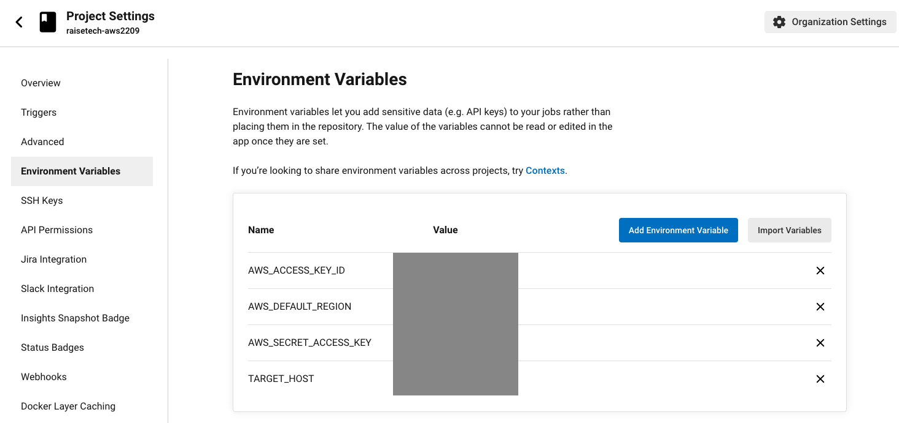
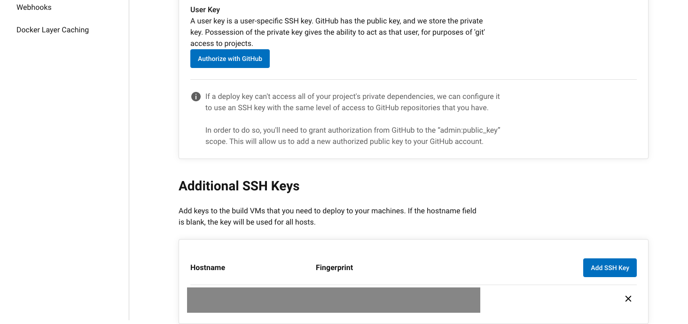

# 第12回課題

## ゴール
* CircleCI上で、Cloudformation・ansible・serverspecのビルドの成功

## 手順

## Cloudformationの追加（lecture10のデータを使用）
*   [cfn_template](https://github.com/takayukionoe/raisetech-aws2209/tree/main/cfn_template)を使用

## ansibleの構築（gitのインストール）
*  ansibleをインストール
*  playbookとinventoryを作成[（データはこちら）](https://github.com/takayukionoe/raisetech-aws2209/tree/lecture14th/ansible)

## serverspecの構築（gitのインストール確認）
*  rubyのインストール
~~~
$ bundle install 
~~~

*  serverspecインストール
~~~
$ serverspec-init
~~~

*  serverspec/配下の構築[（データはこちら）](https://github.com/takayukionoe/raisetech-aws2209/tree/lecture14th/serverspec)

## CicleCIのの構築（cfn→ansible→serverspecの順）

*  CiclrCIと該当のリポジトリを紐付け[（手順はこちら）](https://github.com/takayukionoe/raisetech-aws2209/blob/lecture14th/lecture12.md)

*  .circleci/confing.ymlを該当branchに移動

*  CicleCIのProject_settingsの画面で、アクセスキーなどの情報を入力
* 
* 

*  .circleci/confing.ymlを修正（今回はcloudformationでインフラ構築、ansibleでインフラコードか、servespecでチェックを行う）[（confing.ymlはこちら）](https://github.com/takayukionoe/raisetech-aws2209/tree/lecture14th/.circleci)

*  該当ブランチでプルリクをして、ビルドの成功を確認
* 

## 出会ったエラー
* 

* ansible.cfgで、「StrictHostKeyChecking=no」を定義すると解決した

## 感想
* cloudformation、ansible、serverspec（提出はしていないがterrafromも）を今回初めて触ったが、使い方に関してはググれば大体の意味はわかった

* 一方で、それを組み合わせるとなると予期せぬエラーが発生し、つまづく原因となった

* 当たり前かとは思うが、CiclrCIでビルドする前に、ローカルの環境で、各ツールの実行を確認した上で、実行すると結果的に出戻りは減りそう。

* 今回、CicleCI上で、cfnやterraformでインフラ構築したが、その後のansibleでエラー沼にハマったため、アプリのデプロイまでの構築は、ansibleの復習が終わった後実施。

* 再度ansibleの構築の整理からやり直した上で、再度課題を提出する（ポートフォリオになるため、別途提出）

